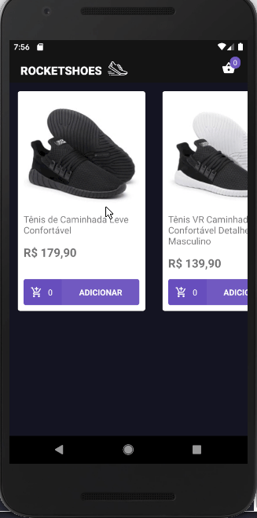

## RocketShoes (React Native)


This is a sample mobile application (shoe store).

### Technologies

This project was developed at the RocketSeat GoStack Bootcamp with the following technologies:

-  [React Native](https://facebook.github.io/react-native/)
-  [styled-components](https://www.styled-components.com/)
-  [Redux](https://redux.js.org/)
-  [Redux Saga](https://redux-saga.js.org/)

ESLint and EditorConfig were also used to maintain the code pattern.

### Demo



### How To Use

Follow the instructions below to run an application:

```bash
# install all dependencies
yarn install

# start the data server (json-server api)
yarn api:server

# android simulator/device running and:
react-native run-android

# ios simulator/device running and:
react-native run-ios
```

Made with ♥ by Márcio França Lima. [Contact me](https://www.linkedin.com/in/m%C3%A1rcio-fran%C3%A7a-lima-916454187/)
